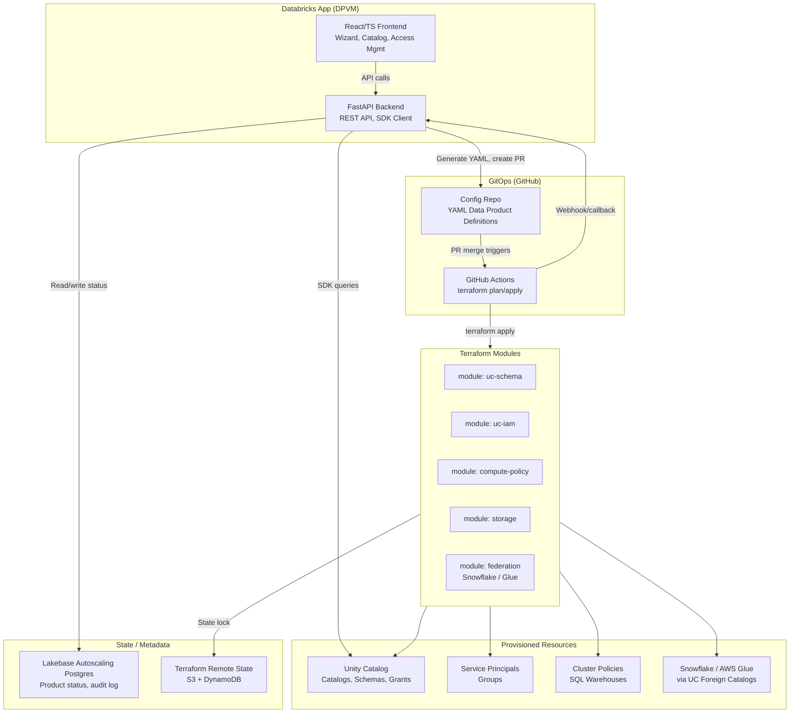

# Data Product Vending Machine -- Execution Plan

## Architecture Overview



## Project Structure

```
unitycatalog_platform_dataproducts_manager/
├── app.yaml                          # Databricks App manifest
├── requirements.txt                  # Python deps (FastAPI, databricks-sdk, etc.)
├── backend/
│   ├── main.py                       # FastAPI entrypoint
│   ├── config.py                     # Settings (env vars, DB connection)
│   ├── models/
│   │   ├── data_product.py           # Pydantic models for data product CRUD
│   │   └── access_request.py         # Pydantic models for access requests
│   ├── routers/
│   │   ├── products.py               # /api/products CRUD endpoints
│   │   ├── access.py                 # /api/access grant/revoke endpoints
│   │   ├── catalog.py                # /api/catalog discovery endpoints
│   │   └── webhooks.py               # /api/webhooks GitHub callback
│   ├── services/
│   │   ├── git_service.py            # GitHub API: branch, commit YAML, open PR
│   │   ├── terraform_service.py      # Trigger GHA workflows, poll status
│   │   ├── uc_service.py             # Databricks SDK: list schemas, grants, tags
│   │   └── config_generator.py       # Render YAML from Pydantic model
│   └── db/
│       ├── connection.py             # Lakebase Autoscaling Postgres connection
│       └── migrations.py             # Schema migrations
├── frontend/
│   ├── package.json
│   ├── tsconfig.json
│   ├── vite.config.ts
│   ├── index.html
│   └── src/
│       ├── App.tsx
│       ├── main.tsx
│       ├── api/                      # Typed API client (fetch wrapper)
│       ├── pages/
│       │   ├── Dashboard.tsx         # Product catalog grid
│       │   ├── CreateWizard.tsx      # Multi-step create form
│       │   ├── ProductDetail.tsx     # Status, lineage links, access mgmt
│       │   └── AccessRequests.tsx    # Steward approval queue
│       ├── components/
│       │   ├── ProductCard.tsx
│       │   ├── StatusBadge.tsx
│       │   ├── ClassificationTag.tsx
│       │   └── WizardSteps/         # Wizard step components
│       └── types/
│           └── index.ts             # Shared TypeScript interfaces
├── terraform/
│   ├── modules/
│   │   ├── data-product/            # Root module (composes sub-modules)
│   │   │   ├── main.tf
│   │   │   ├── variables.tf
│   │   │   └── outputs.tf
│   │   ├── uc-schema/               # UC catalog + schema
│   │   ├── uc-iam/                  # Service principal, groups, grants
│   │   ├── compute-policy/          # Cluster policies, SQL warehouse
│   │   ├── storage/                 # S3 prefix / external location
│   │   └── federation/              # Snowflake connection, Glue foreign catalog
│   ├── environments/
│   │   ├── dev.tfvars
│   │   └── prod.tfvars
│   ├── backend.tf                   # S3 + DynamoDB remote state config
│   ├── providers.tf                 # databricks, aws, snowflake providers
│   └── data-products/               # Generated per-product .tf files from YAML
├── configs/                          # Git-backed YAML data product definitions
│   └── _template.yaml               # Template for new data products
├── .github/
│   └── workflows/
│       ├── terraform-plan.yml        # On PR: terraform plan + comment
│       └── terraform-apply.yml       # On merge to main: terraform apply
└── README.md
```

---

## Phase 1: Project Scaffolding and Backend Core

### 1a. Initialize project skeleton

- Create `app.yaml` for Databricks Apps deployment (command: `uvicorn backend.main:app`, resources: `sql-warehouse`)
- Create `requirements.txt` with pinned deps: `fastapi`, `uvicorn`, `databricks-sdk`, `pydantic`, `PyGithub`, `pyyaml`, `psycopg2-binary`
- Create `backend/main.py` with FastAPI app, CORS middleware, and router mounts on `/api` prefix
- Create `backend/config.py` with Pydantic `Settings` class reading env vars (`DATABRICKS_HOST`, `GITHUB_TOKEN`, `GITHUB_REPO`, `LAKEBASE_DSN`)

### 1b. Define data models

Core Pydantic model in `backend/models/data_product.py`:

```python
class DataProductCreate(BaseModel):
    name: str                          # e.g. "adverse_events"
    display_name: str
    owning_domain: Literal["clinical", "rnd", "commercial"]
    data_steward_email: str
    classification: Literal["public", "internal", "confidential", "restricted_phi"]
    cost_center: str
    description: str
    target_platform: Literal["databricks", "snowflake", "glue"] = "databricks"

class DataProductStatus(str, Enum):
    PENDING_APPROVAL = "pending_approval"
    PROVISIONING = "provisioning"
    ACTIVE = "active"
    UPDATE_IN_PROGRESS = "update_in_progress"
    DEPRECATED = "deprecated"
    FAILED = "failed"
```

### 1c. Lakebase Autoscaling state store

Provision a Lakebase Autoscaling Postgres instance for the DPVM application state. Table schema for `dpvm.products`:

- `id` (UUID PK), `name`, `owning_domain`, `data_steward_email`, `classification`, `cost_center`, `status`, `target_platform`, `catalog_name`, `schema_name`, `git_pr_url`, `terraform_run_id`, `created_by`, `created_at`, `updated_at`

Companion table `dpvm.access_requests`:

- `id`, `product_id` (FK), `requester_email`, `access_level` (read/write), `status` (pending/approved/denied), `approved_by`, `created_at`, `resolved_at`

Companion table `dpvm.audit_log`:

- `id`, `product_id`, `action`, `actor_email`, `details_json`, `timestamp`

### 1d. CRUD API endpoints

| Endpoint | Method | Purpose |
|---|---|---|
| `/api/products` | POST | Create: validate, persist to Lakebase Autoscaling, generate YAML, open PR |
| `/api/products` | GET | List all products with status |
| `/api/products/{id}` | GET | Detail view with UC metadata enrichment |
| `/api/products/{id}` | PATCH | Update tags, compute, classification |
| `/api/products/{id}/deprecate` | POST | Soft-delete lifecycle |
| `/api/access` | POST | Request access to a product |
| `/api/access/{id}/approve` | POST | Steward approves, triggers grant update |
| `/api/catalog/schemas` | GET | Live query UC information_schema |
| `/api/webhooks/github` | POST | GitHub Actions callback on TF completion |

---

## Phase 2: GitOps Integration (Config Generation + GitHub PR Automation)

### 2a. YAML config template

File: `configs/_template.yaml`

```yaml
data_product:
  name: "{{ name }}"
  display_name: "{{ display_name }}"
  owning_domain: "{{ owning_domain }}"
  catalog: "{{ owning_domain }}_prod"
  schema: "{{ name }}"
  classification: "{{ classification }}"
  cost_center: "{{ cost_center }}"
  target_platform: "{{ target_platform }}"

  iam:
    owner_service_principal: "spn-{{ name }}"
    groups:
      read: "{{ name }}_read"
      write: "{{ name }}_write"
    members:
      read: []
      write: []

  compute:
    cluster_policy: "default"
    sql_warehouse: false

  tags:
    domain: "{{ owning_domain }}"
    classification: "{{ classification }}"
    cost_center: "{{ cost_center }}"

  status: "active"
```

### 2b. Git service (`backend/services/git_service.py`)

Uses `PyGithub` library to:

1. Create a branch `dpvm/create-{product_name}-{short_uuid}`
2. Render and commit `configs/{domain}/{product_name}.yaml`
3. Open a PR targeting `main` with a structured description (product metadata, requester, classification)
4. Return PR URL for tracking

For **updates** (access grants, tag changes): same flow -- modify existing YAML, commit, open PR.

### 2c. GitHub Actions workflows

**`terraform-plan.yml`** (on PR open/update):

- Checkout repo, setup Terraform
- For each changed YAML in `configs/`, generate corresponding `.tf` file via a Python script (`scripts/yaml_to_tf.py`)
- Run `terraform plan` scoped to affected products
- Post plan output as PR comment

**`terraform-apply.yml`** (on merge to main):

- Same generation step
- Run `terraform apply -auto-approve`
- On success/failure, call back to DPVM webhook: `POST /api/webhooks/github` with product ID and status

---

## Phase 3: Terraform Modules

### 3a. Root module: `terraform/modules/data-product/`

Composes sub-modules. Input is the parsed YAML config. Key variables: `product_name`, `owning_domain`, `classification`, `target_platform`.

### 3b. Sub-module: `uc-schema/`

```hcl
resource "databricks_schema" "product" {
  catalog_name = var.catalog_name
  name         = var.schema_name
  owner        = databricks_service_principal.owner.application_id
  properties   = var.tags
}
```

### 3c. Sub-module: `uc-iam/`

- `databricks_service_principal` for the product owner
- `databricks_group` for `{product}_read` and `{product}_write`
- `databricks_grants` on the schema for each group (SELECT for read, ALL PRIVILEGES for write)

### 3d. Sub-module: `compute-policy/`

- `databricks_cluster_policy` scoped to the product's service principal
- Optional `databricks_sql_endpoint` (serverless warehouse) if requested

### 3e. Sub-module: `storage/`

- `aws_s3_object` or prefix configuration for the product's managed storage
- `databricks_external_location` if external tables are needed

### 3f. Sub-module: `federation/` (Snowflake / Glue interop)

- For Snowflake: `databricks_connection` resource pointing to the Snowflake account, `databricks_catalog` of type `FOREIGN` using the connection
- For AWS Glue: `databricks_catalog` of type `FOREIGN` referencing the Glue Data Catalog ARN
- Grants on the foreign catalog follow the same IAM pattern

---

## Phase 4: React Frontend

### 4a. Scaffold React app

- Vite + React + TypeScript
- Tailwind CSS for styling
- React Router for navigation
- Key dependencies: `@tanstack/react-query` for data fetching, `react-hook-form` + `zod` for form validation

### 4b. Pages

**Dashboard (`Dashboard.tsx`)**:

- Grid of ProductCards showing all data products
- Filterable by domain, classification, status, platform
- Search bar
- "Create New" CTA button

**Create Wizard (`CreateWizard.tsx`)**:

- Multi-step form: (1) Basic Info --> (2) Classification and Compliance --> (3) Compute Options --> (4) Platform Target --> (5) Review and Submit
- On submit, POST to `/api/products`
- Show PR link after creation

**Product Detail (`ProductDetail.tsx`)**:

- Status badge (Pending Approval / Provisioning / Active / Deprecated)
- Metadata: domain, classification, cost center, steward
- Access management panel: current members in read/write groups, "Request Access" button
- Deep links to Databricks UI (schema explorer, lineage view)
- "Deprecate" button for stewards/admins

**Access Requests (`AccessRequests.tsx`)**:

- Steward-facing queue of pending access requests
- Approve/deny buttons
- History of past decisions

### 4c. Build integration

- Vite builds to `frontend/dist/`
- FastAPI serves the built static files at `/` (SPA fallback)
- API routes live under `/api/`

---

## Phase 5: Cross-Platform Interop (Snowflake / Glue)

- The `target_platform` field in the data product config drives which Terraform sub-modules are invoked
- **Databricks-native**: provisions UC schema, storage, IAM (default path)
- **Snowflake**: provisions a UC foreign catalog via `databricks_connection` pointing at the Snowflake account; schemas/tables in Snowflake are discoverable through UC
- **AWS Glue**: provisions a UC foreign catalog referencing the Glue Data Catalog ARN; Glue databases appear as UC schemas
- All three paths share the same IAM module -- grants are managed in UC regardless of where the physical data lives
- The frontend wizard shows platform-specific fields (e.g., Snowflake account URL, Glue catalog ARN) conditionally

---

## Phase 6: Governance, Audit, and Non-Functional Requirements

- **Audit trail**: Every backend endpoint writes to `dpvm.audit_log` with actor, action, and details
- **Git as audit**: Every infra change is a PR with full commit history; PR description links back to the DPVM product ID
- **Idempotency**: Terraform is inherently idempotent; the YAML-to-TF generation script is deterministic
- **Auth**: Databricks App OAuth provides user identity; FastAPI middleware extracts the authenticated user from the `X-Forwarded-Email` / OAuth token
- **RBAC**: Three roles enforced in the backend -- Producer (create/update own products), Steward (approve access, update tags), Admin (all operations)
- **State locking**: Terraform remote backend (S3 + DynamoDB) prevents concurrent applies

---

## Key Technical Decisions

- **Lakebase Autoscaling Postgres** for application state rather than a Databricks Delta table -- gives us transactional CRUD semantics suited to an operational app, is natively available in the Databricks App runtime, and the autoscaling tier scales to zero when idle (cost-efficient for bursty DPVM usage patterns)
- **YAML configs in Git** as the source of truth for infrastructure, not the Lakebase DB -- the DB tracks status/metadata, Git tracks desired state
- **PyGithub** for Git operations rather than shelling out to `git` CLI -- cleaner API, works in the containerized Databricks App environment
- **`yaml_to_tf.py` bridge script** to convert YAML configs into Terraform variable files (`.tfvars.json`) rather than using Terraform's native YAML functions -- more flexible for validation and cross-platform branching logic
